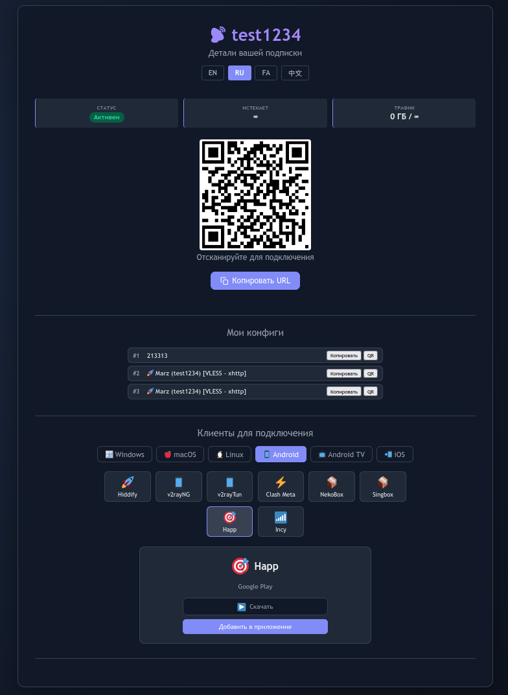

# Микро версия страницы подписки

- Размер менее 120кб
- Нет внешних зависимостей (даже у стоковой страницы Marzban тянется js для генерации QR)
- Генерирует QR
- Есть список клиентов со ссылками на загрузку и кнопками импорта через deeplink (к сожалению проверил не все клиенты, но должно работать и формат deeplink в коде исправить не сложно)

## Авторы

- **korn3r** — *идея, дизайн, разработка*
- **DeepSeek AI** — *консультации и помощь в написании кода* ([deepseek.com](https://deepseek.com))
